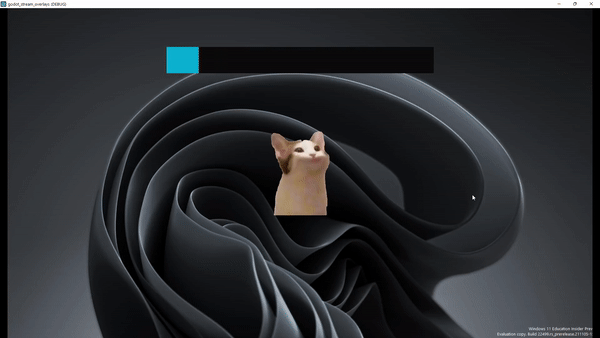
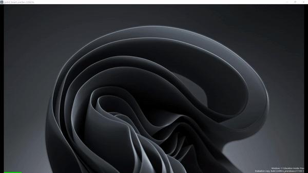

# Godot Streaming Overlays

⚠️ Everything is subject to change as I'm actively working on it! ⚠️

This is a collection of various overlays, made from streaming, with Godot! I'm making them live on [Twitch](https://twitch.tv/mreliptik)

## Projects

### Characters overlay

Similar to [Stream avatars](https://store.steampowered.com/app/665300/Stream_Avatars/) where you have characters on screen, representing your current viewers.

### Facecam overlay

An overlay made to replace your webcam. You can use different images (mouth open/closed) to change based on the mic input.

### Spectrum analyzer

Using the microphone (or any other audio stream) display a spectrum analyzer (frequency analysis). 

## HOW TO USE

Each project is using a transparent window, so you can set it to the size you want and capture it with your streaming software. 

- For example with OBS, just setup a "Game Capture" source, and check "Allow Transparency" and voilà!

*TODO: Add specific directions for each projects* 

## HOW TO CONTRIBUTE

If you want to contribute, please open an issue before, or join my [Discord](https://discord.gg/83nFRPTP6t) to discuss it! 

I'm open to PR for fixes or improvements, and even new overlays if you want to!

## LICENSES

This project is distributed under the MIT license, check [LICENSE](LICENSE).

Developped by me MrEliptik!
 
- [Twitter](https://twitter.com/VicMeunier)
- [Twitch](https://twitch.tv/mreliptik)
- [YouTube](https://www.youtube.com/c/MrEliptik)
- [Discord](https://discord.gg/83nFRPTP6t)

### CONTRIBUTORS

Made with [contrib.rocks](https://contrib.rocks).

### ADDONS

- [GIFT](https://github.com/MennoMax/gift) - Twitch chat API addon
- [Ridiculous Coding](https://github.com/jotson/ridiculous_coding) - Ridiculous addon for Godot Engine that adds screenshake and explosions to your coding experience
